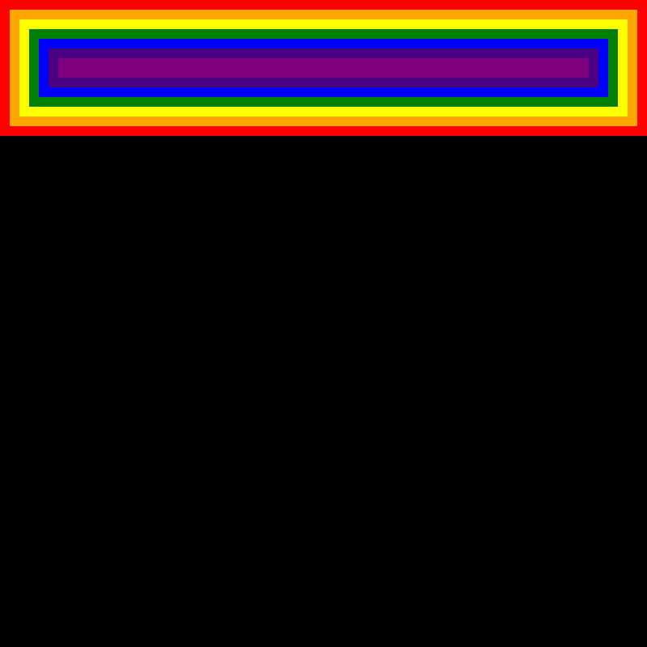

# Serval - an Experimental Web Browser Engine

[](https://travis-ci.com/hayatoito/serval)
[](https://crates.io/crates/serval)

**Serval** is an experimental web browser engine written in Rust. The author
(@hayatoito) is using Serval as a playground when designing and implementing a
new idea or concept into the Web Platform before starting to implement it
actually in Chromium [Blink](https://www.chromium.org/blink) engine in C++.

I'd love to have a small rendering engine which has only essential parts so I
can experiment something new easily and get insights from there quickly. Rust
would be better than C++ for this kind of prototyping.

## Highlights

- Serval is not for end users.
- Serval is an experimental minimum rendering engine. I only implement what I
  need for my experiments in the rendering engine.
- Some people might consider Serval as a good project for educational purposes,
  however, that is not my goal.
- Serval is my personal project. Serval is not related to Chromium Blink engine.
  I commit nothing about Serval.

## Features

- [x] DOM (element and text)
- [x] HTML (This is NOT HTML which you know. Serval HTML is implemented as an
      s-expression, as of now)
- [x] CSS (simple selector)
- [x] Layout (block layout)
- [x] Paint (canvas and png)
- [ ] Layout (inline layout)
- [ ] Paint (output as json)
- [ ] WASM binding, interpreter, JIT
- [ ] Shadow DOM
- [ ] Copy-on-Write shadow trees
- [ ] WebTemplate
- [ ] Parallel style recalc and layout
- [ ] Networking, asynchronous I/O based scheduling
- [ ] Interactive UI (I think which is never implemented)

# Examples

Given the following _HTML_ (in an s-expression)

```
(div class=a
     (div class=b
          (div class=c
               (div class=d
                    (div class=e
                         (div class=f
                              (div class=g))))))))
```

and CSS,

```css
* {
  display: block;
  padding: 12px;
}
.a {
  background: #ff0000;
}
.b {
  background: #ffa500;
}
.c {
  background: #ffff00;
}
.d {
  background: #008000;
}
.e {
  background: #0000ff;
}
.f {
  background: #4b0082;
}
.g {
  background: #800080;
}
```

Serval can output png as follows:

```shellsession
> serval paint ./example.html ./example.css ./example.png png
```

example.png:



# Acknowledgments

[Matt Brubeck: Let's build a browser engine](https://limpet.net/mbrubeck/2014/08/08/toy-layout-engine-1.html)
